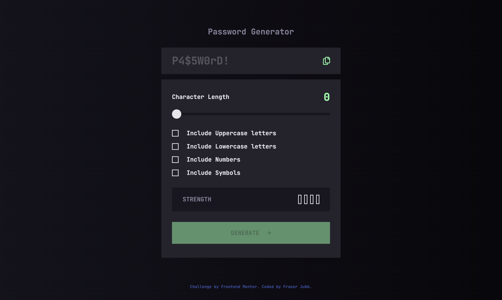

# FM - Password generator app Solution - Fraser Jubb

This is a solution to [this challenge on Frontend Mentor](https://www.frontendmentor.io/challenges/<link>).

## 📖 Table of contents

- [Overview](#overview)
  - [Project Screenshot](#project-screenshot)
  - [Project Links](#project-links)
- [My Process](#my-process)
  - [Built With](#built-with)
  - [Enhancements Beyond the Brief and Noteworthy Considerations](#enhancements-beyond-the-brief-and-noteworthy-considerations)
  - [What I Learned](#what-i-learned)
  - [Continued Development](#continued-development)
  - [Useful Resources](#useful-resources)
- [Noteworthy Updates Since Initial Submission](#noteworthy-updates-since-initial-submission)
- [Connect With Me](#connect-with-me)

## Overview

### Project Screenshot



### Project Links

- Solution URL: [Click Here](INSERT URL HERE)
- Live Site URL: [Click Here](INSERT URL HERE)
- Frontend Mentor Profile: [@fraserjubb](https://www.frontendmentor.io/profile/fraserjubb)

## My Process

### Built With

- HTML
- CSS
- JavaScript
- Desktop-First Workflow

### Enhancements Beyond the Brief and Noteworthy Considerations

- I took care to ensure that at least one random character from each selected character group is included in every generated password. Any remaining characters are then selected at random, and the final password is shuffled to make certain proper randomness.

- Password strength is primarily length-based, mirroring the approach used by tools such as Bitwarden. While selected character types affect generation, the strength indicator intentionally treats length as the dominant security factor.

- The Generate button is disabled if the user has not selected at least one character group, or if the chosen character length is less than the number of selected character groups. Helper messages are displayed after the first generation attempt if the user later creates this invalid state.

- I deviated slightly from the Figma design by moving the helper copy text below the clipboard button. This prevents layout overlap when longer passwords (e.g. 20 characters) are generated.

### What I Learned

In this particular project:

1. After writing the bulk of the HTML, instead of moving straight to CSS, I focused on implementing the JavaScript logic first. Having the password generation logic working early made it much easier to wire up DOM selectors later, as I already knew the core functionality was solid.

2. I learned how to copy text to the clipboard using the Clipboard API — an extremely useful technique for many real-world interfaces.

```js
function copyText(text) {
  navigator.clipboard.writeText(text).then(() => showCopiedMessage());
}
```

3. I learned about the Fisher–Yates shuffle algorithm, which provides an unbiased way to randomise an array. This ensures the final password characters are evenly distributed and avoids predictable character positioning.

```js
function shuffle(array) {
  for (let i = array.length - 1; i > 0; i--) {
    const randomChar = Math.floor(Math.random() * (i + 1));
    [array[i], array[randomChar]] = [array[randomChar], array[i]];
  }
```

3. Using AI tools (such as ChatGPT) proved especially helpful for accessibility checks and for quickly identifying browser quirks that needed adjustment.

### Continued Development

After submitting this project, I wish to develop the following:

1. In HTML, improving my ability to identify early on when SVGs will require interactivity, so I can use inline <svg> elements instead of  tags. Retrofitting interactivity later can slow development and disrupt momentum.

### Useful Resources

- Nothing of note used for this project.
- [writeText Method (MDN Documentation)](https://developer.mozilla.org/en-US/docs/Web/API/Clipboard/writeText)

## Noteworthy Updates Since Initial Submission

1. No major updates since submitted.

## Connect With Me

<a href="https://github.com/fraserjubb"></a>
<a href="https://www.linkedin.com/in/fraser-jubb"></a>
<a href="https://www.instagram.com/thejubbzone/"></a>
<a href="https://x.com/fraserjubb"></a>
<a href="https://www.youtube.com/@thejubbzone2374"></a>
<a href="mailto:fraserjubb.dev@gmail.com"></a>

<br/>
